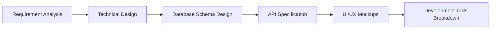

# 🔄 KongrePad Development Workflow

> **Comprehensive development methodology and project management guide for enterprise Laravel applications**

[](#agile-methodology)
[](https://laravel.com)
[](#quality-assurance)

---

## 📋 Table of Contents

1. [Development Methodology](#-development-methodology)
2. [Project Phases & Timeline](#-project-phases--timeline)
3. [Sprint Planning Process](#-sprint-planning-process)
4. [Feature Development Workflow](#-feature-development-workflow)
5. [Code Review Process](#-code-review-process)
6. [Testing Strategy](#-testing-strategy)
7. [Deployment Process](#-deployment-process)
8. [Quality Assurance](#-quality-assurance)
9. [Team Structure & Responsibilities](#-team-structure--responsibilities)
10. [Communication & Documentation](#-communication--documentation)

---

## 🎯 Development Methodology

### Agile Development Framework
We follow a **hybrid Agile approach** combining Scrum methodology with Kanban flow management for maximum flexibility and efficiency.

### Core Principles
- **Iterative Development**: 2-week sprints with continuous feedback
- **Module-First Approach**: Develop each module independently 
- **Test-Driven Development**: Write tests before implementation
- **Continuous Integration**: Automated testing and deployment
- **Documentation-First**: Comprehensive documentation for all features

### Development Environment Setup
```bash
# 1. Clone the repository
git clone https://github.com/kongrepad/portal.kongrepad.com.git
cd portal.kongrepad.com

# 2. Install dependencies
composer install
npm install

# 3. Environment setup
cp .env.example .env
php artisan key:generate

# 4. Database setup
php artisan migrate:fresh --seed

# 5. Development server
php artisan serve
npm run dev
```

---

## 📅 Project Phases & Timeline

### Phase 1: Foundation (Weeks 1-3) 🏗️
**Priority**: Critical | **Team Size**: 3-4 developers

#### Sprint 1.1 - Infrastructure Setup (Week 1)
```yaml
Goals:
  - Project scaffolding and environment setup
  - Multi-tenant architecture implementation
  - UUID7 trait and base model setup
  - Authentication system (Sanctum)

Deliverables:
  - ✅ Laravel 12 project setup with all dependencies
  - ✅ Multi-tenant database structure
  - ✅ User authentication and registration
  - ✅ Basic admin panel structure
  - ✅ API authentication with Sanctum

Tasks:
  - Setup Laravel project with required packages
  - Implement HasUuid7 trait
  - Create tenant and user management
  - Setup API routes and middleware
  - Create basic test suite structure
```

#### Sprint 1.2 - System Core Module (Week 2)
```yaml
Goals:
  - System foundation services
  - Cache and queue management
  - Internationalization setup
  - Basic notification system

Deliverables:
  - ✅ System cache management
  - ✅ Job queue processing
  - ✅ Country and language data (162 countries, 5 languages)
  - ✅ Basic email notification system

Tasks:
  - Implement CacheService and LocalizationService
  - Setup Redis for caching and queues
  - Seed countries and languages data
  - Create notification service foundation
```

#### Sprint 1.3 - Multi-Tenant Infrastructure (Week 3)
```yaml
Goals:
  - Complete tenant isolation
  - Tenant settings management
  - Subdomain routing
  - User role management

Deliverables:
  - ✅ Complete tenant data isolation
  - ✅ Tenant settings configuration
  - ✅ Role-based access control (RBAC)
  - ✅ Subdomain routing system

Tasks:
  - Implement TenantScope for all models
  - Create tenant settings management
  - Setup subdomain middleware
  - Implement role and permission system
```

### Phase 2: Conference Core (Weeks 4-7) 🎪
**Priority**: High | **Team Size**: 4-5 developers

#### Sprint 2.1 - Conference Management (Week 4)
```yaml
Goals:
  - Conference CRUD operations
  - Basic venue management
  - Conference lifecycle states

Deliverables:
  - ✅ Conference creation and management
  - ✅ Venue management (physical/virtual/hybrid)
  - ✅ Conference status management
  - ✅ Basic conference listing and filtering

Tasks:
  - Implement Conference model and service
  - Create ConferenceController with full CRUD
  - Implement venue management system
  - Setup conference status workflow
```

#### Sprint 2.2 - Session & Speaker Management (Week 5)
```yaml
Goals:
  - Session scheduling system
  - Speaker assignment and management
  - Participant registration

Deliverables:
  - ✅ Session creation and scheduling
  - ✅ Speaker assignment to sessions
  - ✅ Participant registration system
  - ✅ QR code generation for participants

Tasks:
  - Implement session management system
  - Create speaker assignment functionality
  - Build participant registration flow
  - Setup QR code generation service
```

#### Sprint 2.3 - Program & Schedule Management (Week 6)
```yaml
Goals:
  - Conference program structure
  - Advanced scheduling features
  - Program chair management

Deliverables:
  - ✅ Conference program management
  - ✅ Advanced session scheduling
  - ✅ Program chair assignment
  - ✅ Schedule conflict detection

Tasks:
  - Implement program structure
  - Create advanced scheduling logic
  - Build program chair management
  - Add schedule validation and conflict detection
```

#### Sprint 2.4 - Core API & Frontend (Week 7)
```yaml
Goals:
  - Complete API for conference core
  - Basic frontend interfaces
  - API documentation

Deliverables:
  - ✅ RESTful API for all conference features
  - ✅ Basic admin panel interfaces
  - ✅ API documentation (OpenAPI/Swagger)
  - ✅ Frontend participant registration

Tasks:
  - Complete API endpoint implementation
  - Create admin panel views
  - Generate API documentation
  - Build participant-facing interfaces
```

### Phase 3: Interactive Features (Weeks 8-11) 🙋
**Priority**: Medium | **Team Size**: 3-4 developers

#### Sprint 3.1 - Q&A System (Week 8)
```yaml
Goals:
  - Real-time question submission
  - Question moderation system
  - Upvoting and answer system

Deliverables:
  - ✅ Question submission and display
  - ✅ Question moderation workflow
  - ✅ Upvoting system
  - ✅ Speaker answer interface

Tasks:
  - Implement question submission system
  - Create moderation interface
  - Build upvoting functionality
  - Setup real-time updates with WebSockets
```

#### Sprint 3.2 - Real-time Polling (Week 9)
```yaml
Goals:
  - Poll creation and management
  - Real-time voting system
  - Results display and analytics

Deliverables:
  - ✅ Poll creation and configuration
  - ✅ Real-time voting interface
  - ✅ Live results display
  - ✅ Poll analytics and reporting

Tasks:
  - Implement poll management system
  - Create real-time voting interface
  - Build results visualization
  - Add poll analytics dashboard
```

#### Sprint 3.3 - Survey System (Week 10)
```yaml
Goals:
  - Comprehensive survey builder
  - Response collection and analysis
  - Advanced question types

Deliverables:
  - ✅ Survey creation and management
  - ✅ Multiple question types support
  - ✅ Response collection system
  - ✅ Survey analytics and reporting

Tasks:
  - Build survey creation interface
  - Implement multiple question types (single choice, multiple choice, rating, text)
  - Create response collection system
  - Add analytics and reporting features
  - Implement survey scheduling and automation
```

#### Sprint 3.4 - Real-time Features Integration (Week 11)
```yaml
Goals:
  - WebSocket integration
  - Real-time notifications
  - Live updates across system

Deliverables:
  - ✅ WebSocket server setup
  - ✅ Real-time notifications
  - ✅ Live content updates
  - ✅ Real-time participant interaction

Tasks:
  - Setup WebSocket server (Pusher/Laravel WebSockets)
  - Implement real-time notification system
  - Add live updates to all interactive features
  - Create real-time participant dashboard
```

### Phase 4: Advanced Features (Weeks 12-16) 🚀
**Priority**: Medium-Low | **Team Size**: 4-6 developers

#### Sprint 4.1 - Document & Content Management (Week 12)
```yaml
Goals:
  - File upload and management
  - Content access control
  - Document sharing system

Deliverables:
  - ✅ Document upload and storage
  - ✅ Access level management
  - ✅ Document sharing and download tracking
  - ✅ Content search and filtering

Tasks:
  - Implement file storage system (S3/Local)
  - Create access control system
  - Build document management interface
  - Add search and filtering capabilities
```

#### Sprint 4.2 - Display Management (Week 13)
```yaml
Goals:
  - Digital signage system
  - Screen content management
  - Timer and countdown features

Deliverables:
  - ✅ Screen management system
  - ✅ Dynamic content display
  - ✅ Timer and countdown functionality
  - ✅ Screen layout customization

Tasks:
  - Build screen management system
  - Create dynamic content rendering
  - Implement timer and countdown features
  - Add layout customization options
```

#### Sprint 4.3 - Analytics & Logging (Week 14)
```yaml
Goals:
  - Comprehensive analytics system
  - Activity tracking
  - Performance monitoring

Deliverables:
  - ✅ Participant activity tracking
  - ✅ Analytics dashboard
  - ✅ Performance metrics
  - ✅ Custom reporting system

Tasks:
  - Implement activity logging system
  - Create analytics dashboard
  - Add performance monitoring
  - Build custom reporting features
```

#### Sprint 4.4 - Gamification System (Week 15)
```yaml
Goals:
  - Interactive debate system
  - Virtual exhibition stands
  - Score games and leaderboards

Deliverables:
  - ✅ Debate system with voting
  - ✅ Virtual exhibition platform
  - ✅ QR code-based games
  - ✅ Leaderboard and achievements

Tasks:
  - Build debate platform
  - Create virtual exhibition system
  - Implement QR code games
  - Add leaderboard and achievement system
```

#### Sprint 4.5 - System Integration & Polish (Week 16)
```yaml
Goals:
  - Complete system integration
  - Performance optimization
  - Security hardening

Deliverables:
  - ✅ Full system integration
  - ✅ Performance optimization
  - ✅ Security audit and hardening
  - ✅ Production deployment preparation

Tasks:
  - Complete cross-module integration
  - Optimize database queries and caching
  - Conduct security audit
  - Prepare production deployment
```

---

## 🏃 Sprint Planning Process

### Sprint Structure (2 weeks)
```yaml
Sprint Planning (Day 1):
  Duration: 4 hours
  Participants: Development Team, Product Owner, Scrum Master
  Output: Sprint Backlog, Sprint Goal, Task Assignments

Daily Standups (Days 2-9):
  Duration: 15 minutes
  Format: What did you do? What will you do? Any blockers?
  Time: 9:00 AM daily

Mid-Sprint Review (Day 5):
  Duration: 1 hour
  Purpose: Progress check, blockers resolution
  Participants: Development Team, Product Owner

Sprint Review (Day 10):
  Duration: 2 hours
  Purpose: Demo completed features
  Participants: All stakeholders

Sprint Retrospective (Day 10):
  Duration: 1 hour
  Purpose: Process improvement
  Participants: Development Team, Scrum Master
```

### Story Point Estimation
```yaml
Fibonacci Scale:
  1 point: Very simple task (1-2 hours)
  2 points: Simple task (2-4 hours)
  3 points: Medium task (4-8 hours)
  5 points: Complex task (1-2 days)
  8 points: Very complex task (2-3 days)
  13 points: Epic (requires breakdown)

Team Velocity:
  Target: 40-60 story points per sprint
  Team Size: 4-5 developers
  Sprint Duration: 2 weeks
```

---

## ⚡ Feature Development Workflow

### 1. Feature Planning


### 2. Development Process
```bash
# Step 1: Create feature branch
git checkout -b feature/conference-management
git push -u origin feature/conference-management

# Step 2: Database Migration
php artisan make:migration create_conferences_table
php artisan make:model Conference

# Step 3: Service Layer
php artisan make:class Services/ConferenceService

# Step 4: Repository Layer
php artisan make:class Repositories/ConferenceRepository

# Step 5: Controller
php artisan make:controller ConferenceController --api --requests

# Step 6: API Resources
php artisan make:resource ConferenceResource
php artisan make:resource ConferenceCollection

# Step 7: Tests
php artisan make:test ConferenceManagementTest --feature
php artisan make:test ConferenceServiceTest --unit

# Step 8: Documentation
# Update API documentation
# Add code comments and docblocks
```

### 3. Code Implementation Standards
```php
// Example implementation structure
class ConferenceService
{
    public function __construct(
        private ConferenceRepositoryInterface $repository,
        private NotificationService $notificationService,
        private AnalyticsService $analyticsService
    ) {}
    
    public function createConference(CreateConferenceRequest $request): Conference
    {
        return DB::transaction(function () use ($request) {
            // 1. Validate business rules
            $this->validateConferenceCreation($request);
            
            // 2. Create conference
            $conference = $this->repository->create($request->validated());
            
            // 3. Handle side effects
            $this->handleConferenceCreated($conference);
            
            // 4. Return result
            return $conference;
        });
    }
    
    private function validateConferenceCreation(CreateConferenceRequest $request): void
    {
        // Business validation logic
    }
    
    private function handleConferenceCreated(Conference $conference): void
    {
        // Dispatch events, send notifications, etc.
        event(new ConferenceCreated($conference));
    }
}
```

---

## 🔍 Code Review Process

### Review Checklist
```yaml
Code Quality:
  - [ ] Follows Laravel naming conventions
  - [ ] Proper use of dependency injection
  - [ ] Error handling implemented
  - [ ] Input validation in place
  - [ ] Business logic in service layer
  - [ ] Database queries optimized

Security:
  - [ ] Input sanitization
  - [ ] SQL injection prevention
  - [ ] XSS protection
  - [ ] CSRF protection
  - [ ] Authorization checks
  - [ ] Sensitive data encryption

Testing:
  - [ ] Unit tests written
  - [ ] Feature tests implemented
  - [ ] Edge cases covered
  - [ ] Mocking used appropriately
  - [ ] Test coverage > 80%

Documentation:
  - [ ] Code comments for complex logic
  - [ ] PHPDoc blocks for public methods
  - [ ] API documentation updated
  - [ ] README updates if needed
```

### Review Process
```bash
# 1. Create Pull Request
git push origin feature/conference-management
# Create PR on GitHub/GitLab

# 2. Automated Checks
# - PHPStan analysis
# - Test suite execution
# - Code style validation

# 3. Manual Review
# - Code quality review
# - Business logic validation
# - Security assessment

# 4. Approval and Merge
# - Minimum 2 approvals required
# - All tests must pass
# - Merge to develop branch
```

---

## 🧪 Testing Strategy

### Testing Pyramid
```yaml
Unit Tests (70%):
  - Service layer logic
  - Model methods and relationships
  - Helper functions and utilities
  - Repository implementations

Integration Tests (20%):
  - API endpoint testing
  - Database integration
  - External service integration
  - Cross-module communication

End-to-End Tests (10%):
  - Complete user workflows
  - Critical business processes
  - UI functionality
  - Performance testing
```

### Test Implementation
```php
// Unit Test Example
class ConferenceServiceTest extends TestCase
{
    use RefreshDatabase;
    
    public function test_it_can_create_a_conference()
    {
        // Arrange
        $tenant = Tenant::factory()->create();
        $user = User::factory()->create(['tenant_id' => $tenant->id]);
        $data = [
            'title' => 'Test Conference',
            'start_date' => '2024-06-01',
            'end_date' => '2024-06-03',
        ];
        
        // Act
        $conference = $this->conferenceService->createConference($data);
        
        // Assert
        $this->assertInstanceOf(Conference::class, $conference);
        $this->assertEquals('Test Conference', $conference->title);
        $this->assertDatabaseHas('conferences', ['title' => 'Test Conference']);
    }
}

// Feature Test Example
class ConferenceManagementTest extends TestCase
{
    use RefreshDatabase;
    
    public function test_user_can_create_conference_via_api()
    {
        // Arrange
        $user = User::factory()->create();
        $data = [
            'title' => 'API Test Conference',
            'start_date' => '2024-06-01',
            'end_date' => '2024-06-03',
        ];
        
        // Act & Assert
        $response = $this->actingAs($user, 'sanctum')
                         ->postJson('/api/v1/conferences', $data);
        
        $response->assertStatus(201)
                ->assertJson([
                    'success' => true,
                    'data' => [
                        'title' => 'API Test Conference',
                    ],
                ]);
    }
}
```

---

## 🚀 Deployment Process

### Environment Strategy
```yaml
Development:
  - Local development environment
  - Docker containers for consistency
  - Database: SQLite/MySQL
  - Queue: Sync driver

Staging:
  - Production-like environment
  - Database: MySQL
  - Queue: Redis
  - Cache: Redis
  - Storage: S3

Production:
  - High availability setup
  - Database: MySQL with read replicas
  - Queue: Redis cluster
  - Cache: Redis cluster
  - Storage: S3 with CloudFront CDN
  - Monitoring: New Relic + CloudWatch
```

### Deployment Pipeline
```bash
# 1. Automated Testing
composer test
npm run test

# 2. Build Assets
npm run production

# 3. Database Migration (Zero Downtime)
php artisan migrate --force

# 4. Cache Optimization
php artisan config:cache
php artisan route:cache
php artisan view:cache

# 5. Queue Worker Restart
php artisan queue:restart

# 6. Health Check
curl -f http://app.kongrepad.com/health || exit 1

# 7. Rollback Strategy (if needed)
git revert [commit-hash]
php artisan migrate:rollback
```

---

## 🎯 Quality Assurance

### Code Quality Tools
```bash
# Static Analysis
./vendor/bin/phpstan analyse
./vendor/bin/psalm

# Code Style
./vendor/bin/pint

# Security Scanning
composer audit

# Performance Testing
artillery run load-test.yml
```

### Quality Metrics
```yaml
Code Coverage: >80%
Cyclomatic Complexity: <10
Maintainability Index: >80
Technical Debt: <10%
Security Vulnerabilities: 0

Performance Targets:
  - API Response Time: <200ms
  - Page Load Time: <2s
  - Database Query Time: <100ms
  - Cache Hit Ratio: >90%
```

---

## 👥 Team Structure & Responsibilities

### Core Team Roles
```yaml
Tech Lead (1):
  - Architecture decisions
  - Code review oversight
  - Technical roadmap
  - Mentoring developers

Senior Developers (2):
  - Module implementation
  - Code reviews
  - Technical design
  - Junior developer mentoring

Mid-Level Developers (2):
  - Feature implementation
  - Bug fixes
  - Testing
  - Documentation

Junior Developers (1):
  - Simple feature implementation
  - Bug fixes
  - Test writing
  - Documentation updates

DevOps Engineer (1):
  - Infrastructure management
  - CI/CD pipeline
  - Monitoring setup
  - Performance optimization

QA Engineer (1):
  - Test planning
  - Manual testing
  - Automation testing
  - Bug reporting
```

### Communication Channels
```yaml
Daily Communication:
  - Slack: #kongrepad-dev
  - Daily standups: 9:00 AM
  - Ad-hoc discussions

Weekly Communication:
  - Sprint planning: Mondays 2:00 PM
  - Tech review: Fridays 3:00 PM
  - Team retrospective: Bi-weekly

Documentation:
  - Confluence for specifications
  - GitHub Wiki for technical docs
  - API documentation in codebase
  - Meeting notes in shared drives
```

---

## 📚 Communication & Documentation

### Documentation Standards
```yaml
Code Documentation:
  - PHPDoc for all public methods
  - Inline comments for complex logic
  - README files for modules
  - API documentation (OpenAPI)

Process Documentation:
  - Architecture decisions (ADRs)
  - Database schema documentation
  - Deployment procedures
  - Troubleshooting guides

User Documentation:
  - Admin panel user guide
  - API integration guide
  - Feature specifications
  - Configuration manual
```

### Knowledge Sharing
```yaml
Technical Sessions:
  - Weekly tech talks
  - Code review sessions
  - Architecture discussions
  - Best practices sharing

External Learning:
  - Laravel conferences
  - Online training courses
  - Technical blog reading
  - Open source contributions
```

---

## 📊 Progress Tracking

### Key Performance Indicators (KPIs)
```yaml
Development Metrics:
  - Sprint velocity
  - Story completion rate
  - Bug discovery rate
  - Code review cycle time

Quality Metrics:
  - Test coverage percentage
  - Bug escape rate
  - Code quality score
  - Technical debt ratio

Team Metrics:
  - Team productivity
  - Knowledge sharing sessions
  - Developer satisfaction
  - Skill development progress
```

### Reporting Dashboard
- **Daily**: Automated build status, test results
- **Weekly**: Sprint progress, velocity charts
- **Monthly**: Quality metrics, performance reports
- **Quarterly**: Architecture review, roadmap updates

---

## 🎯 Success Criteria

### Technical Goals
- ✅ All 11 modules implemented and tested
- ✅ >80% test coverage across codebase
- ✅ Sub-200ms API response times
- ✅ Zero critical security vulnerabilities
- ✅ Scalable to 10,000+ concurrent users

### Business Goals
- ✅ Multi-tenant architecture supporting unlimited tenants
- ✅ Real-time interactive features working smoothly
- ✅ Comprehensive analytics and reporting
- ✅ Mobile-responsive interface
- ✅ International support (162 countries, 5 languages)

### Team Goals
- ✅ All team members skilled in Laravel ecosystem
- ✅ Efficient development workflow established
- ✅ High-quality code review process
- ✅ Comprehensive documentation maintained
- ✅ Continuous improvement culture

---

**📅 Last Updated**: 2024-01-15 16:45 UTC  
**👨‍💻 Maintained By**: KongrePad Development Team  
**📝 Version**: 2.0.0  
**🔗 Related Documents**: 
- [Project Architecture](./PROJECT-ARCHITECTURE.md)
- [Module Specifications](./MODULE-SPECIFICATIONS.md)
- [Migration Implementation Guide](./MIGRATION-IMPLEMENTATION-GUIDE.md)
- [Laravel Naming Standards](./LARAVEL-NAMING-STANDARDS.md) 